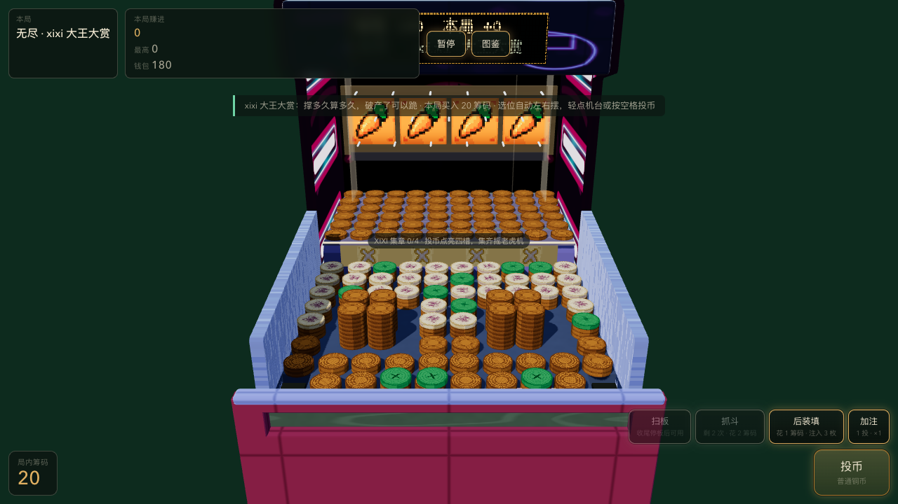
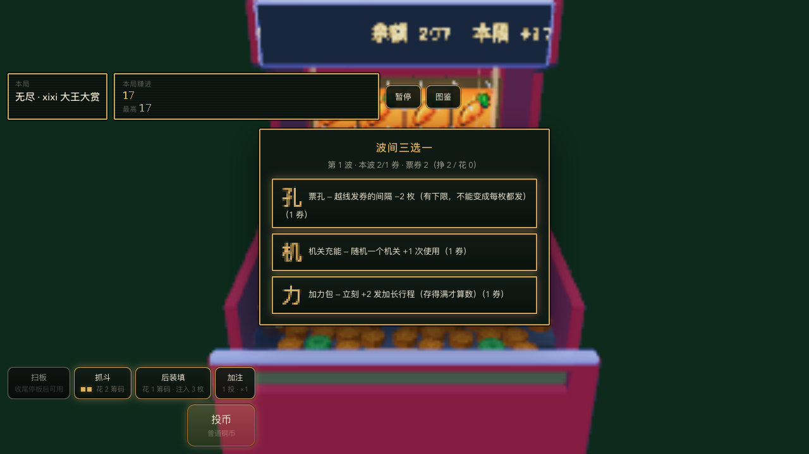
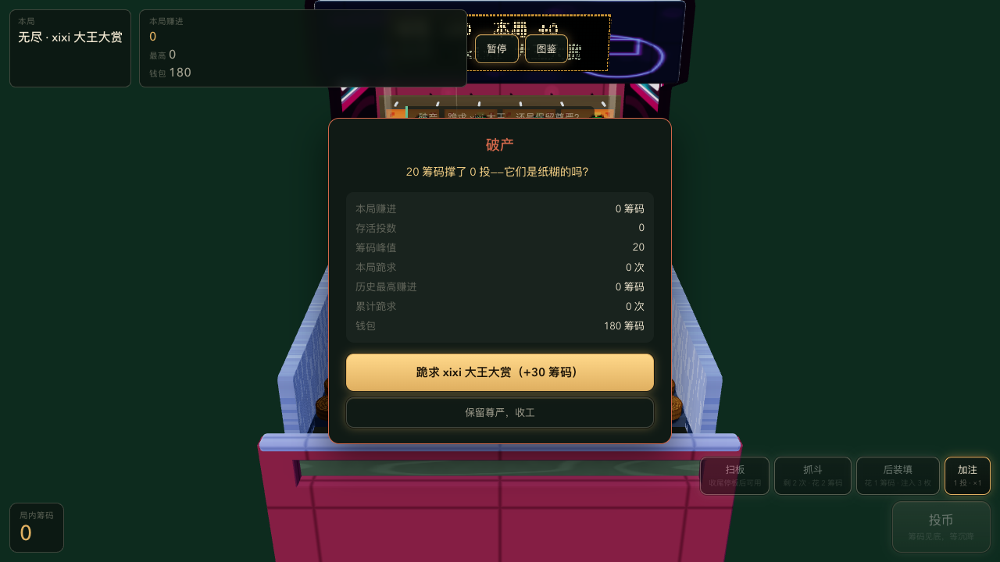
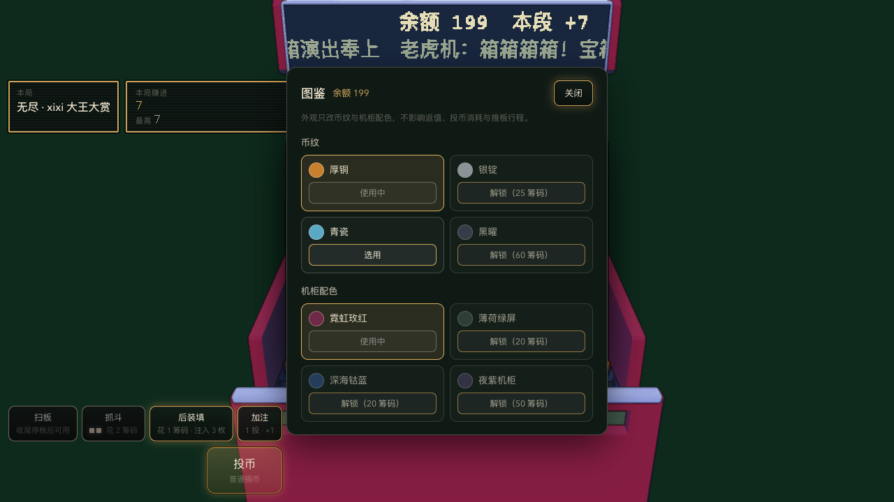

# 币塔街机 · 网页推币机

浏览器里的 3D 推币机。Three.js 负责渲染，Rapier3D 负责刚体物理，TypeScript + Vite 构建。

没有服务器、没有分数、没有后端存档 —— 打开就是一个满盘的台子（预置 **318 枚币**），
硬币的每一次越线都由真实刚体模拟算出来，不是脚本动画。

---

## 玩法

无尽模式「**xixi 大王大赏**」是唯一的玩法（v3 起战役六关已摘除）。
「撑多久、堆多高」就是全部目标。

- **投币**：左右自动选位，轻点机台投币。币落在推板顶面，被推板的**摩擦拖曳**推向前缘，
  掉进币床（S13 起「台面输送」已归零，见 `constants.ts` 的 `TABLE.conveyor`）
- **越线返筹码**：币心越过得分线即结算。筹码既是局内的投币资源，也是局外图鉴的购买力
- **六种币**（数值的唯一真源是 `src/game/kinds.ts`，下表只是导览）

  | 币种 | 币面 | 返值 | 说明 |
  | --- | --- | --- | --- |
  | 普通铜币 | （无字） | 5 × 概率闸门 | 盘面主体，越线时只有 9% 真的返值（S23 基值 ×5） |
  | 花纹筹码 | 桃 | 1（吃倍率） | 自己带一道 50% 闸门，越过线也要掷一次 |
  | 绿色返币筹码 | ＋ | 2（固定） | 不吃任何倍率，收尾期的复活通道 |
  | 金色大赏币 | 赏 | 5（固定） | 每 30 投注入一枚，方差的主杠杆 |
  | 钻石筹码 | 钻 | 25（固定） | 独立 3D 几何；老虎机四同的排场之一 |
  | 宝箱硬币 | 箱 | 50（固定） | 独立 3D 几何；S16 起从「派演出」改成固定返值 |

- **XIXI 集章**：落点按 x 分成 X·I·X·I 四段，币落到币床那一刻点亮对应槽位；
  集齐四槽摇一次背板老虎机。权重表在 `xixi.ts`（`SLOT_OUTCOME_WEIGHTS`，四段同一个 `roll` 轴、**不吃第三条随机数**）：
  `win3 43.5 / win4 1.5 / fine 15 / miss 40` ——
  **三同是常规奖**（投放演出 / 加力），画面上画成「三格同 + 一格环带相邻的差一格」；
  **四同才是大奖**，按图案分四种排场（加力 = 连续 4 发加长行程、
  币塔 = jackpot 级柱数、钻石 / 宝箱 = 对应色的一排喷泉），多吃的 1.8 秒停顿是给仪式的而不是额外随机数；
  **杂牌（miss）无罚**，四格两两不同，「没凑齐」在画面上自证
- **老虎机罚钱罚的是胡萝卜四连，而且罚的是"欠"**：`fine` 档收罚金，**手头的不够部分直接转成欠款**（S5b）
  ⇒ 罚金不会凭空消失，也不该让玩家"付不出就等于没发生"
- **三个机关**（全在局内花筹码）：扫板、抓斗、后装填
  （P7 起「风险转轮」已删除——它的定位由 XIXI 老虎机承接；「加注」是投币档位 1/2/5 筹码 → ×1/×2/×4，不是机关）
- **热度与热区**：连落越多返值越高（3 连 ×1.5 / 5 连 ×2 / 8 连 ×3）；
  得分线上有一条周期性左右扫的亮条，在它范围内越线**再翻一倍**
- **破产是内容，不是惩罚**：输光之后弹的不是「破产窗」而是一条**续玩报价**——
  可以就地借一笔贷款接着玩这一局（欠款进存档，之后每一笔入账按比例先还债），
  也可以「跪求 xixi 大王大赏」拿一笔递减救济（30→24→19→15→12→10）。
  跪来的钱是**脏钱**：它进余额、能接着投，但计入 `beggedTotal`，
  于是 **可花 = 余额 − 累计跪求额**（`SaveStore.spendable`）——
  这是一次性永久折减而不是锁死，所以图鉴解锁等"永久进度"不会被跪求刷出来。
  ⚠️ 这道折减与上面那条刷新守卫是**两道独立的闸**，别合并成一条判据。
- ★ **S4 之后没有「钱包 / 局内筹码」两个口袋了**：只有**一个余额**。
  「一局」= 把手头的余额投到见底为止，所以「收工把桌上筹码回存钱包」这笔转账**不存在了**
  （`economy` 的恒等式随之从「钱包守恒」改成**终身账守恒**，见下）。
  仍然要防的是同一个循环：「跪求 → 刷新 → 白拿起始余额」。
  守卫现在在 `SaveStore` 的加载分支里，条件比旧版**多两条**：
  `balance <= 0 且没有历史局 且没有跪求记录 且没有欠款 且 beggedTotal === 0` 才允许重置
  （`src/systems/SaveStore.ts:531-540`）。
  合并账户之后余额里可能正含着刚跪来的那笔钱，所以**只看「没跪求过历史」不够**，
  还要求本次存档里 `beggedTotal` 为 0；欠着钱的人更不能靠刷新白拿（S2 那条）。
  用例面（`tests/save-migration.spec.ts`）：反例两条 —— `debt > 0` 与 `beggedTotal > 0` ——
  外加一条**正对照**（把 `beggedTotal` 拿掉必须放行重置），没有正对照的话
  "不许重置"那两条会在重置逻辑整个坏掉时一起假绿。
  ⚠️ `beggedTotal` 那条与正对照是 10-01 新写的，**还没跑过**（当时 S6 批在飞，不能起浏览器抢 CPU）；
  跑法与状态记在计划的收尾清单里。

期望值是**故意做成负的**：庄家终会赢，玩家的本事体现在「能把入场筹码撑多久」。
设计目标是「一条命 60~90 投」。

## 截图

| 开局满盘 | 局中推进 |
| --- | --- |
|  |  |

| 破产结算 | 图鉴 |
| --- | --- |
|  |  |

移动端（`shots/mobile-390x844.png` 等）与各关开局截图见 `shots/` 目录。

## 技术栈

| 层面 | 选型 |
| --- | --- |
| 语言 / 构建 | TypeScript（`strict`）+ Vite 8 |
| 渲染 | Three.js 0.184 |
| 物理 | Rapier3D 0.12（`@dimforge/rapier3d-compat`，WASM） |
| 调试面板 | lil-gui |
| 端到端测试 | Playwright（Chromium + Mobile Safari 双 project） |
| 音频 | Web Audio API（`src/systems/AudioSystem.ts`，静态 mp3 资源） |

固定步长 1/60 秒 + 累加器钳制（单帧最多追 4 个子步），
避免切后台回来时追帧把物理打爆。

## 本地运行

需要 Node 18+。

```bash
npm install

npm run dev        # 开发服务器 http://127.0.0.1:5188
npm run build      # tsc 类型检查 + vite 构建到 dist/
npm run preview    # 预览构建产物 http://127.0.0.1:4188
npm run test       # Playwright 端到端测试（真实物理试玩，整局约 1~2 分钟）
npm run verify:visual   # 只跑视觉回归
```

## 项目结构

```
src/
  main.ts              入口：建 Game、启动、HMR 时释放
  core/                与玩法无关的底座
    Loop.ts              固定步长主循环 + 累加器
    Renderer.ts          Three.js 场景 / 相机 / 渲染器
    InputController.ts   指针与键盘输入
  entities/            刚体实体
    Coin.ts              单枚币（几何 + 物理 + 视觉）
    CoinPool.ts          对象池，池满时 acquire() 返回 null 而不是静默失败
    Pusher.ts            推板（运动学刚体，顶面 + 推币面一体）
  game/                纯逻辑与数值（不碰渲染，可单独测试）
    Game.ts              编排层（约 1900 行）
    constants.ts         机台几何、物理常量、币种、经济数值
    cabinetShape.ts      机柜外壳外形**唯一真源**（尺寸 + 解析盒 + 侧墙折线轮廓）
    layout.ts            币床 / 币塔的程序化摆盘与自检
    endless.ts           无尽模式的盘面配置（318 枚预置）
    economy.ts           经济纯函数：越线返值、加注倍率、三账本恒等式
    xixi.ts              XIXI 四槽集章 + 老虎机权重表
    cosmetics.ts         币纹 / 机柜配色外观表
  render/               渲染层（材质 / 贴图 / 取景）
    ToonMaterial.ts      卡通材质工厂（全场景唯一材质入口）
    RampLut.ts           色带 LUT（按调色板去重）
    cabinetTexture.ts    机柜 Arcane 风 CanvasTexture（招牌 / 得分线 / 热区）
    iconTexture.ts       XIXI 图标图集
    PixelScale.ts        内部分辨率倍率 + 最近邻开关（两个正交旋钮，默认原生）
    cameraRig.ts         **机位唯一真源**（取景框 + 球坐标反解，自动取景与调试面板共用）
  systems/             系统层
    PhysicsWorld.ts      Rapier 世界与每帧步进
    TableBuilder.ts      机台、围板、钉子、得分线、机柜外壳建模
    DebugTools.ts        lil-gui 调参面板（含 S22「摄影机（角度 / 坐标）」分组）
    Hud.ts / CollectionPanel.ts   界面与图鉴
    RunState.ts / SaveStore.ts    局内状态机 / 本地存档与**单一余额 + 欠款**（S4 之后没有"钱包"这个口袋了）
    SlotMachine.ts / ShowDirector.ts   背板老虎机与投放演出
    Mechanisms.ts        三个机关（扫板 / 抓斗 / 后装填）
    Telemetry.ts         帧率、穿透深度、异常速度等诊断
    PerformanceGovernor.ts / MotionPrefs.ts   画质分档与动效偏好
scripts/
  verify-game.mjs      独立试玩验证脚本（不经过测试运行器）
  inspect-threejs-canvas.mjs / tune-physics.mjs
tests/
  bot-playtest.spec.ts 机器人按实时节奏投币的真实物理试玩
shots/                 各状态截图（README 与视觉回归引用）
```

## 验证与测试

### 调试面板（`?debug`）

带 `?debug` 打开会挂上 lil-gui 调参面板。其中「**摄影机（角度 / 坐标）**」分组（S22）用来
摆机位并复现某张截图：

- **角度**：方位角 yaw / 俯角 pitch / 到观察点距离
- **坐标**：相机 x·y·z（观察点不动、朝向跟着变）与观察点 x·y·z（相机不动、只有朝向变）
- 「回到默认取景」= 交还给 `fitCamera()` 的自动取景

角度与坐标**不是两份数据**：真源只有 `cameraRig`（`src/render/cameraRig.ts`）里的
`position` 与 `target` 两个点，角度是 `(position − target)` 的球坐标反解，
四组控件只是同一份数据的四个视图。

★ 拖动任意一个手动控件都会把「自动取景」关掉（= 交出机位所有权）——
不这样的话，之后改 FOV 或改窗口尺寸会被 `fitCamera()` 弹回默认视角。

### 画面分辨率与像素风（`?pixel`）

默认档是**原生分辨率 + 平滑采样**（`src/render/PixelScale.ts` 的 `PIXEL_SCALE_DEFAULTS`）。
块状像素风改成显式通道，两个旋钮**正交**：

| 旋钮 | 管什么 | 关掉会怎样 |
| --- | --- | --- |
| `targetHeight` / `upscale`（面板「像素目标高度」/ `?pixel=N`） | 内部分辨率 = CSS 尺寸 ÷ 整数倍率 | 回到按视口推导 |
| `pixelated`（面板「像素化」） | 放大方式：最近邻 or 平滑 | 只是不再块状，**倍率不变** |

- `?pixel=2/3/4` = 显式倍率 **并**打开最近邻（写数字的意图是「看像素风」，只降分辨率不换采样是半条路径）。
- `?pixel=off` = 原生 + 平滑，等价于默认档，留着纯粹为了 A/B 对照时一眼可见。
- 画质分档（`PerformanceGovernor`）只动 `targetHeight`，所以低配机上的表现是**轻微模糊**而不是方块；
  ⚠️ 玩家能不能受住"被自动降档"是另一件事：暂停面板里有一颗**「画质：自动 / 已锁定」**按钮
  （#48，10-01 用户点名「不要切画质啊」之后加的）。锁上走的是同一个 `freeze()`，
  **不是第二套换挡逻辑**，锁不写进存档（刷新就回到自动），解锁时滞回计数会被清零，
  免得"解锁瞬间立刻补一次换档"。自动档本身仍然开着 —— 它救的是低端设备，不该被锁功能废掉；
  想让降档变「更方块」就同时把 `pixelated` 打开。
- 倍率曾和 `pixelated` 绑在一起：关掉像素化会把倍率吞回 1，于是默认档下降档**静默不省任何东西**。
  这条被 `verify-game.mjs perf` 的「关最近邻后倍率仍是 2」钉住，别再合回去。

### 独立验证脚本

先 `npm run dev`，然后：

```bash
node scripts/verify-game.mjs [模式]
```

| 模式 | 内容 |
| --- | --- |
| `probe` | 满盘预置稳定性 + 单枚币完整路径（默认） |
| `layout` | 台面配置摘要（含币池预算余量告警） |
| `physics` | 满盘静置 10 秒 / 推板 10 循环节拍 / 上层留存 |
| `endless` | 开局态、大赏币、热度倍率、**余额见底 → 续玩报价**、跪求、收工不动账、热区、加注 |
| `economy` | **终身账守恒**（② 六桶进出账，S4 之后不再有"钱包守恒"）、局级恒等式、脏钱不等式与收工不动账、单位期望 < 1 与赌狗税（④）、timeout 占比 ≤ 30 %（⑤）、破产哨兵（⑤′）、局长四数（均值 / 中位 / 触底 / timeout 占比） |
| `xixi` | XIXI 集章与背板老虎机 |
| `mechanisms` | 扫板 / 抓斗 / 后装填 |
| `pace` | 逐循环推进节奏（推板行程选型的判据） |
| `sweep` | 推板行程参数扫描（`SWEEP=0.8,1.0,1.16` 分批覆盖） |
| `show` / `lane` / `perf` / `shots` / `accept` | 投放演出 / 自动选位 / 帧率 / 截图 / 验收清单 |
| `cabinet` | 机柜外壳：解析盒 = 实测盒、镜像对称、四条接口硬约束、**侧墙折线逐顶点**、两张核对截图 |
| `cabinetTex` | 机柜 Arcane 贴图：三张 CanvasTexture 独立实例、调色板槽数、draw call、程序数 |
| `camera` | 摄影机机位：角度↔坐标往返恒等、两组自由度隔离、机位所有权、`?debug` 面板端到端（含两张核对截图） |

这个脚本不产生 `test-results` 产物，适合在受限环境里做「真物理能不能推过线」的验证。

### 端到端测试

```bash
npm run test
```

测试通过 `window.__THREE_GAME_TEST_HOOKS__` 注入种子、设置状态、直接投币，
再读 `window.__THREE_GAME_DIAGNOSTICS__` 做断言 —— 所以判据是**引擎算出来的物理量**，
不是截图比对。

> 产物累积超过 50 个文件时，`test-results` 的清空可能被环境拦下。
> 用 `PW_OUTPUT_DIR="/tmp/pw-$(date +%s)" npx playwright test` 换到空目录即可。

## 数值标定

这个项目的物理与经济参数**都是扫出来的，不是拍脑袋定的**，
`src/game/constants.ts` 里每个关键常量都带着完整的实测表格和取舍理由。举两个例子：

**`PHYSICS.erp = 0.8` —— 这台机器上最重要的一个常量。**
它决定币堆能不能站住。Rapier 默认值 0.2 在这个规模下太软：318 枚币压上去，
位置修正打不过载荷，整堆会**沉进地板并就此睡着**（实测 300 枚币床里 299 枚币心在地板以下，
同格层间距从 0.0212 被压到 0.0084 —— 盘面高度被压掉 40%）。单变量扫描：

```
erp  0.20 → 299 枚沉入 / 最低币心 −0.0250   ← Rapier 默认，盘面被压穿
erp  0.60 →  53 枚沉入 / 0.0060
erp  0.70 →   0 枚沉入 / 0.0080             ← 阈值在 0.6~0.7 之间
erp  0.80 →   0 枚沉入 / 0.0080             ← 采用，留余量
```

同一批实验里把求解器迭代次数翻 4 倍只把沉入枚数从 299 降到 293 ——
**瓶颈是刚度，不是迭代次数**。

**`TABLE.pusherTravel = 0.36` —— 推板行程，经过三次重扫。**
行程拉长会把整张币床当刚体推走（0.84 米时实测 8.4 枚/循环、单循环最多 106 枚），
但行程太短又会憋死（0.20 米时最长空档 17 个循环）。
而且它不能只按「憋不憋死」选 —— **推进率是经济的输入**：
规定在 0.36 米（1.087 枚/循环）而不是更保守的 0.30 米，是因为后者会让单局只剩 40 投，
低于「一条命 60~90 投」的设计目标。

**`ENDLESS.bronzePayoutChance = 0.18` —— 全机唯一的主水龙头。**
它不能被代数反推出来，因为「越线/投币」这个分母**自己依赖局长**：
局越短 → 垫底库存还没被推出来 → 越线比越低 → 回收越低 → 局更短，是个自我强化的循环。
最终用 `perDrop ≈ 0.564 + 0.168·ln L` 拟合三个点、解自洽平衡得到 0.18，
再用 `ECON_RUNS=200` 的批量跑核对。实测五局：局长 48~74 投、×1 档回收率 0.46~0.80。

> 结论：**改推进率（推板行程 / 币床几何 / 币堆刚度）之后必须重标经济**，
> 而且必须按自洽平衡解，不能拿单一局长的读数当常数用。

## 说明

- 全部数值与断言都是**可复现**的：随机数走游戏 RNG，测试通过 hook 注入种子
- 经济模块是**纯函数**：不持有状态、不碰物理与渲染，随机数由调用方传入
- 静态资源（`src/*.mp3`）随仓库分发
